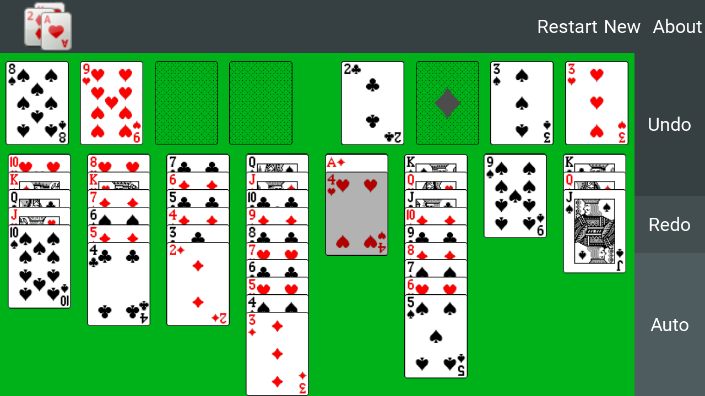

# Freecell4Maemo

This is a port of the Maemo app 'Freecell For Maemo' from the Nokia N900.
The original gtk graphics hsd been replaced by Kivy in order to
allow building an android app.

It might run on any desktop computer in a python subsystem. Also there
are build procedures supplied to build an Android App.

The software is open source as of the GNU General Public License (see LICENSE)

# Usage

Initially the app displays the state of the last played game. To start a
new game select 'New' or to restart and play the same deal again type 'Restart'.

To select a card type onto. A selected card will show with a gray overlay.
Only top cards of stacks can be selected. To perform a move type on anothers
stacks top card or onto an empty field. If such a move is not allowed, the selection
is moved instead if possible.

The 'Auto' button repeatedly moves all top cards to its foundations as long
as one matches.

# Storage permissions (Android only)

The state of the game is stored in the private app storage section.

In the android manifest permissions for WRITE_EXTERNAL_STORAGE and for
MANAGE_EXTERNAL_STORAGE are mentioned. Non of these permissions are
activated automatically.

A user that likes to inspect stored data can allow storage or managment permission
in the system settings. In that case the data is stored in a folder
'/sdcard/.freecell4maemo/'. WARNING: Modification of these files is at Your
on risk.

# Build

To build an android app out of this repository, you need a GNU/Linux system such as Debian, Ubuntu, Fedora, Gentoo or Archlinux.

For more detailed instructions read README.build

# Screenshots

The ported Version

Original on N900

# Original code

http://repository.maemo.org/extras/pool/fremantle/free/f/freecell4maemo/

