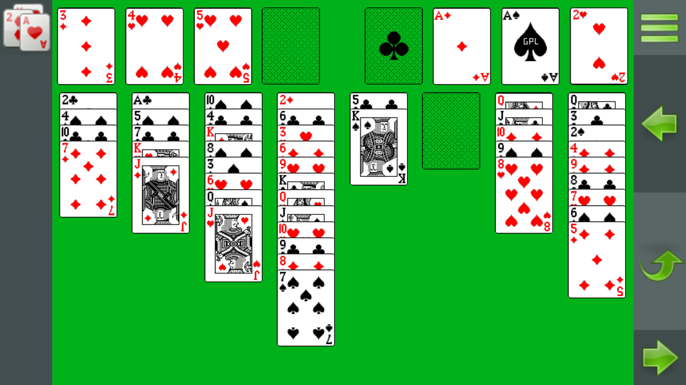
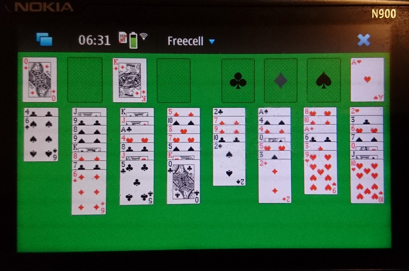

# Freecell4Maemo

This is a port of the Maemo app 'Freecell For Maemo' from the Nokia N900.
The original gtk graphics has been replaced by Kivy in order to
allow building an android app.

It might run on any desktop computer in a python subsystem. Also there
are build procedures supplied to build an Android App.

The software is open source as of the GNU General Public License (see LICENSE)

# Usage

Initially the app displays the state of the last played game. To start a
new game (redeal) select '+' toolbar button on the second toolbar
plane. There is also a button to restart the same game again.

To select the start of a move, select the top card of a stack or of 
a free cell. A selected
card will show with a gray overlay. To perform a move type on another
top card or onto an empty field.
If such a move is not allowed, the selection is moved to the new position.
To deselect type somewhere to the empty play ground..

There are also buttons for undo and redo (arrows to left and to right).
To auto move all matching top cards to its foundations use the up arrow
button.

# Storage permissions (Android only)

The state of the game is stored in the private app storage section.

In the android manifest permissions for WRITE_EXTERNAL_STORAGE and for
MANAGE_EXTERNAL_STORAGE are mentioned. Non of these permissions are
activated automatically nor advertised by the app.

A user who likes to inspect stored data can allow storage or managment permissions
via the system settings. In that case the data is stored in a folder
'/sdcard/.freecell4maemo/'. WARNING: Modification of these files is at Your
on risk.

# Build

To build an android app out of this repository, you need a GNU/Linux system such as Debian, Ubuntu, Fedora, Gentoo or Archlinux.

For more detailed instructions read README.build

# Screenshots

The ported Version

Original on N900

# Original code

http://repository.maemo.org/extras/pool/fremantle/free/f/freecell4maemo/

